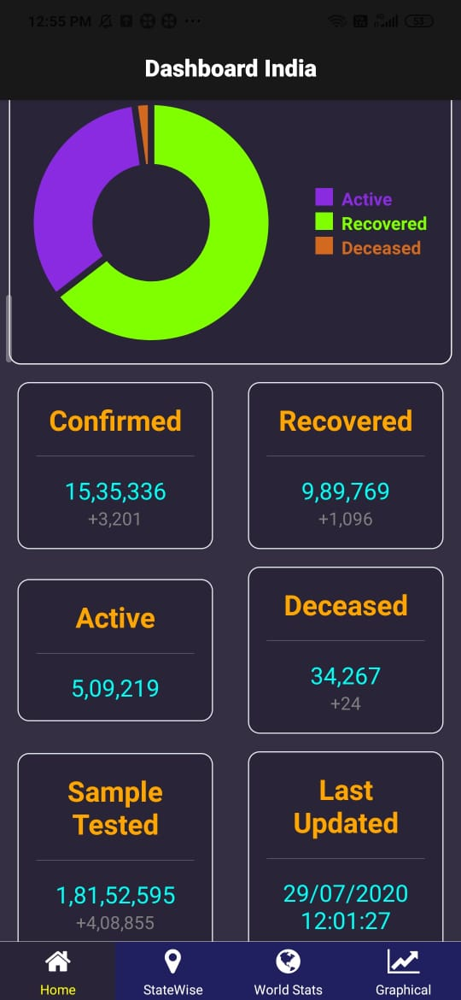
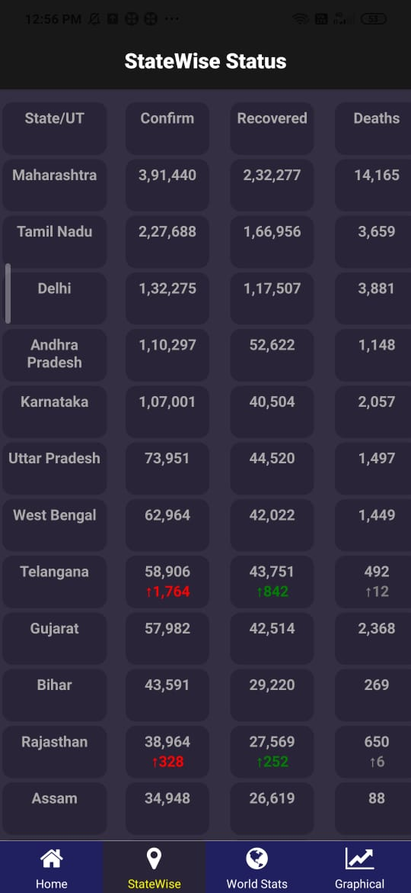
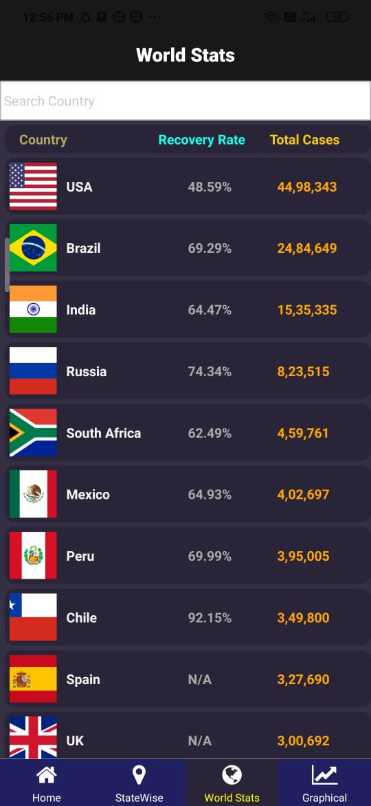
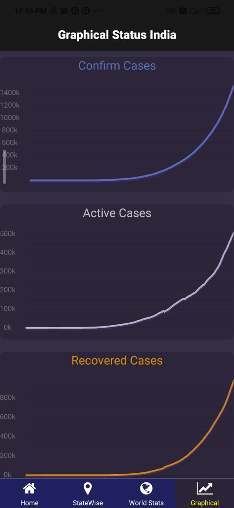

# CovidApp
An android app to track COVID-19 status in India and around the world. 

**Features: -**
 * Fast, Beautiful, Lightweight & Elegant 
 * Detailed home screen
 * State wise and Country wise data
 * Active search bar to search states/countries
 * Pie chart representation for cases in India
 * Country flags

**Some Screenshots: -**

 

 

**Download: -**
* [GitHub Releases](https://github.com/Achal1607/CovidApp.git)

**APIs used: -**

 * [https://api.covid19india.org/](https://api.covid19india.org/)
 * [https://corona.lmao.ninja/](https://corona.lmao.ninja/)

**How to contribute?**
* Fork this repo.
* Push changes to forked repo.
* Make sure everything works.
* Create a pull request.

**Eat, Sleep, Code, Repeat!**
